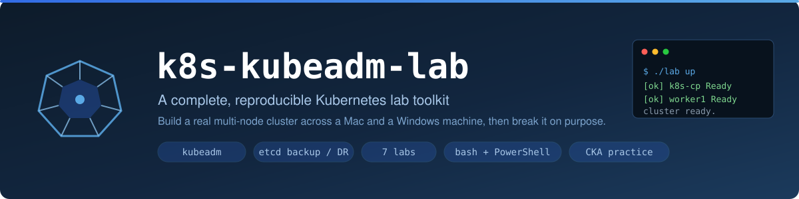
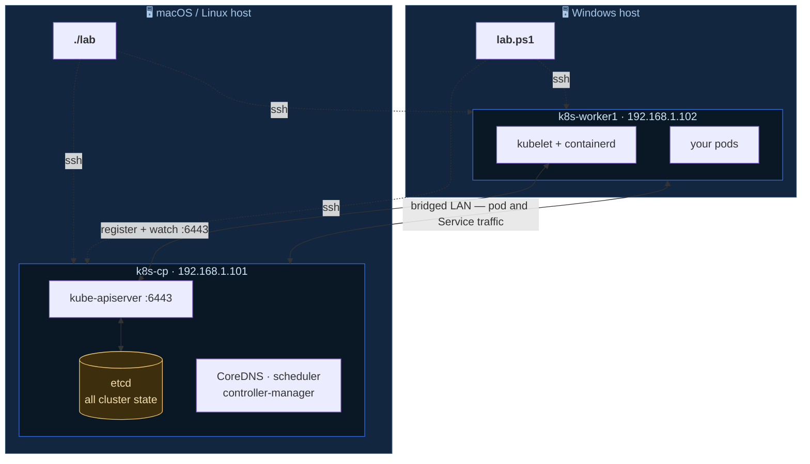

<div align="center">



[](https://github.com/sameeralam3127/k8s-kubeadm-lab/actions/workflows/ci.yml)
[](LICENSE)
[](https://kubernetes.io/releases/)
[](#)
[](#)
[](SECURITY.md)
[-orange.svg)](CONTRIBUTING.md)

</div>

> [!WARNING]
> **This is a teaching lab, not production software.** It builds a deliberately
> simplified cluster, several commands **permanently destroy data**, and every
> script runs as **root** on the nodes it touches. Run it only on throwaway VMs
> you own. Read [DISCLAIMER.md](DISCLAIMER.md) and [SECURITY.md](SECURITY.md)
> before you start.

# k8s-kubeadm-lab

**A complete, reproducible Kubernetes lab toolkit.** Build a real multi-node
cluster with `kubeadm` across a Mac and a Windows machine, then practise the
things that actually matter: rollouts, networking, storage, RBAC, upgrades,
etcd disaster recovery, and troubleshooting under pressure.

Everything is scripted, idempotent and reversible. One command builds the
cluster; one command tears it down; one command puts it back exactly as it was.

```bash
cp lab.env.example lab.env && $EDITOR lab.env   # your two IPs go here
./lab ssh-setup                                 # push an SSH key to the VMs
./lab up                                        # build the whole cluster
```

```powershell
# Windows hosts get the identical toolkit
Copy-Item lab.env.example lab.env; notepad lab.env
.\windows\lab.ps1 ssh-setup
.\windows\lab.ps1 up
```

---

## What you get



More diagrams — the build sequence, Service traffic path, and the etcd restore
flow — are in [docs/ARCHITECTURE.md](docs/ARCHITECTURE.md).

- **A real cluster**, not a single-node toy — pods schedule across machines,
  Services load-balance between them, and node failures behave like node failures.
- **Runs from either side.** A Mac can drive the Windows VM, or Windows can
  drive the Mac VM. Both CLIs speak the same `lab.env`.
- **Seven guided labs**, each with a `verify.sh` that grades your work.
- **A fault injector** (`break-it.sh`) with eight realistic failures to diagnose.
- **Real backup and restore** for etcd, with checksums, rotation and a guided
  disaster-recovery drill.

---

## Requirements

| | Minimum |
|---|---|
| Two machines (or one with enough headroom) | any OS that runs a hypervisor |
| Control-plane VM | 2 vCPU, 4 GB RAM, 25 GB disk |
| Worker VM | 2 vCPU, 2 GB RAM, 25 GB disk |
| Network | both VMs **bridged** onto the same LAN |
| Guest OS | Ubuntu Server 22.04 or 24.04 LTS |
| Host tools | `ssh`, `scp` (built into macOS, Linux and Windows 10+) |

> **Bridged networking is the one thing you cannot compromise on.** NAT keeps the
> VMs invisible to each other and nothing in this lab will work.

---

## Step by step

### 1. Create the two VMs

Download Ubuntu Server from <https://ubuntu.com/download/server>, then:

```bash
# macOS / Linux host
./scripts/host/new-lab-vm.sh --name k8s-cp --iso ~/iso/ubuntu-24.04.iso --memory 4096
```
```powershell
# Windows host
.\windows\Setup-WindowsHost.ps1      # installs OpenSSH, VirtualBox, kubectl
.\windows\New-LabVM.ps1 -Name k8s-worker1 -IsoPath C:\iso\ubuntu-24.04.iso -Start
```

On Apple Silicon the script points you at **UTM** instead — VirtualBox does not
work there. Either way, install Ubuntu with these choices:

- **Network:** accept DHCP, then note the IPv4 address. It must be on your normal
  LAN subnet. `10.0.2.x` means NAT, not bridged — go fix the adapter.
- **Server name:** `k8s-cp` or `k8s-worker1`
- **Tick "Install OpenSSH server"** — the entire toolkit drives the nodes over SSH
- **Snaps:** none

Full detail, including Hyper-V and UTM: [docs/WINDOWS.md](docs/WINDOWS.md).

### 2. Configure the lab

```bash
cp lab.env.example lab.env
$EDITOR lab.env
```

Set four things and leave the rest:

```bash
CP_IP="192.168.1.101"                    # your control-plane VM
WORKERS="k8s-worker1:192.168.1.102"      # your worker(s)
SSH_USER="ubuntu"                        # the user you created
CNI="calico"                             # calico | flannel | cilium
```

### 3. Connect and check

```bash
./lab ssh-setup      # generates a key and installs it (asks for the password once)
./lab check          # config sane? both nodes reachable?
./lab preflight      # CPU, RAM, disk, swap, modules, ports, DNS, clock, peers
```

`preflight` changes nothing — it only reports. Fix every `FAIL` before continuing.

### 4. Build

```bash
./lab up
```

Ten to twenty minutes. It runs preflight, prepares both nodes (swap, sysctl,
containerd with the right cgroup driver, kubeadm/kubelet/kubectl), initialises
the control plane, installs the CNI and add-ons, joins the worker, and finishes
with a live smoke test that deploys a workload and proves DNS and Services work.

Prefer it stepwise? Every stage is its own command:

```bash
./lab prep && ./lab init && ./lab addons && ./lab join && ./lab verify
```

### 5. Use it

```bash
./lab status                    # one-screen overview
./lab kubeconfig                # then: export KUBECONFIG=$PWD/kubeconfig
kubectl get nodes -o wide
./lab labs                      # start the exercises
```

---

## The labs

Each lab is a self-contained exercise with commented manifests and a grader.

| Lab | Topic | Time |
|---|---|---|
| [01](labs/01-workloads/) | **Workloads** — Deployments, self-healing, probes, rollouts and rollback, resources, DaemonSets, CronJobs | 30 min |
| [02](labs/02-services-networking/) | **Services & networking** — ClusterIP, NodePort, headless, cluster DNS, NetworkPolicy | 35 min |
| [03](labs/03-storage/) | **Storage** — emptyDir, PVs/PVCs, dynamic provisioning, ConfigMaps, Secrets, StatefulSets | 30 min |
| [04](labs/04-rbac/) | **RBAC** — ServiceAccounts, Roles vs ClusterRoles, `auth can-i`, real users from client certificates | 35 min |
| [05](labs/05-etcd-dr/) | **etcd & disaster recovery** — snapshots, verification, full restore, what a snapshot does *not* cover | 45 min |
| [06](labs/06-upgrade/) | **Cluster upgrades** — version skew rules, `upgrade apply` vs `upgrade node`, drain/uncordon | 45 min |
| [07](labs/07-troubleshooting/) | **Troubleshooting** — eight injected faults to diagnose and repair | 60 min |

```bash
cat labs/01-workloads/README.md    # the exercise
./labs/01-workloads/verify.sh      # grade yourself
```

**Try the fault injector** — it is the fastest way to build real instincts:

```bash
cd labs/07-troubleshooting
./break-it.sh list
./break-it.sh break 4      # now diagnose it yourself
./break-it.sh hint 4       # stuck?
./break-it.sh solution 4   # the explanation
./break-it.sh fix all      # clean up
```

---

## Backup and disaster recovery

etcd holds every namespace, Deployment, Secret and RBAC rule in your cluster.
Losing it loses everything, even with the nodes still running.

```bash
./lab backup nightly       # snapshot, verify, checksum, rotate, pull to ./backups
./lab backups              # what exists, remote and local
./lab restore --latest     # full restore, with rollback instructions if it fails
```

**Practise the whole cycle in one command:**

```bash
./lab dr-drill
```

It deploys a marker workload, snapshots etcd, deletes the namespace to simulate
the 3am mistake, restores from the snapshot, and proves the workload came back.

Automate it on the control plane once you trust it — see
[Lab 05, Part 6](labs/05-etcd-dr/README.md).

---

## Command reference

| Command | Windows | Does |
|---|---|---|
| `./lab check` | `.\windows\lab.ps1 check` | Validate config and SSH to every node |
| `./lab ssh-setup` | `... ssh-setup` | Create and install an SSH key |
| `./lab preflight` | `... preflight` | Read-only readiness checks |
| `./lab up` | `... up` | Build the entire cluster |
| `./lab prep` / `init` / `join` | same | The individual build stages |
| `./lab addons` | `... addons` | metrics-server, local-path, helm, etcdctl |
| `./lab verify` | `... verify` | Health check plus a live smoke test |
| `./lab status` | `... status` | One-screen overview |
| `./lab kubeconfig` | `... kubeconfig` | Fetch admin.conf for local kubectl |
| `./lab kubectl <args>` | `... kubectl <args>` | Run kubectl on the control plane |
| `./lab ssh cp` | `... ssh cp` | Shell into a node |
| `./lab run all 'uptime'` | `... run all uptime` | Run a command everywhere |
| `./lab backup [label]` | `... backup` | Snapshot etcd, pull it locally |
| `./lab restore [file]` | `... restore` | Restore etcd |
| `./lab dr-drill` | `... dr-drill` | Guided disaster-recovery exercise |
| `./lab diagnostics` | `... diagnostics` | Support bundle from every node |
| `./lab reset all` | `... reset all` | Tear the cluster back down |
| `./lab labs` | `... labs` | List the exercises |

`make` wraps all of these too — `make help`.

---

## When something breaks

```bash
./lab diagnostics       # one tarball per node: kubelet, containerd, events, logs
```

Then work down the ladder — the answer is almost always on one of these rungs:

```
kubectl get nodes                 Is the node there and Ready?
kubectl get pods -A -o wide       What is not Running, and where?
kubectl describe pod <pod>        Events at the bottom - read these FIRST
kubectl logs <pod> --previous     Why the LAST attempt died
kubectl get endpoints <svc>       Empty means selector or readiness, not network
journalctl -u kubelet -f          When the pod was never created at all
crictl ps -a                      When the kubelet cannot reach the runtime
```

Symptom-by-symptom fixes: [docs/TROUBLESHOOTING.md](docs/TROUBLESHOOTING.md).

**Faster than debugging, in a lab:**

```bash
./lab reset all && ./lab up      # ~15 minutes, back to a known-good cluster
```

---

## Repository layout

```
lab                          The CLI (macOS / Linux)
lab.env.example              Copy to lab.env - the ONLY file you edit
Makefile                     make help

scripts/
  lib/common.sh              Logging, retry, wait_for, confirm, config loading
  host/new-lab-vm.sh         Create a bridged VM (VirtualBox; UTM guidance on ARM)
  node/01-preflight.sh       Read-only readiness checks
  node/02-prep-node.sh       Swap, kernel modules, sysctl, hosts, firewall
  node/03-install-containerd.sh   Runtime + the systemd cgroup driver
  node/04-install-kube-tools.sh   kubeadm, kubelet, kubectl (pinned and held)
  node/10-init-control-plane.sh   kubeadm init from a real config file
  node/11-install-cni.sh          Calico / Flannel / Cilium
  node/12-join-worker.sh          Join, with reachability checks first
  node/13-install-addons.sh       metrics-server, local-path, helm, etcdctl
  node/20-verify-cluster.sh       Health check + live smoke test
  node/30-etcd-backup.sh          Snapshot, verify, checksum, rotate
  node/31-etcd-restore.sh         Full restore with rollback instructions
  node/90-reset-node.sh           Tear a node back to clean
  node/99-diagnostics.sh          Collect a support bundle

windows/
  lab.ps1                    The CLI (Windows) - same commands, same lab.env
  Setup-WindowsHost.ps1      OpenSSH, VirtualBox, kubectl, ssh-agent
  New-LabVM.ps1              Create a bridged VirtualBox VM

labs/                        Seven exercises, each with manifests + verify.sh
  07-troubleshooting/break-it.sh   Eight injectable faults

docs/
  ARCHITECTURE.md            How it fits together, with mermaid diagrams
  MANUAL-SETUP.md            Every step by hand - do this once, it is the exam
  CHEATSHEET.md              Every command worth knowing, in one page
  TROUBLESHOOTING.md         Symptom -> cause -> fix
  WINDOWS.md                 Windows host setup and command translations
  images/                    Banner and topology SVGs

.github/
  workflows/ci.yml           Lint, manifest validation, secret scan, link check
  workflows/close-external-prs.yml   Enforces "PRs are not accepted"
  CODEOWNERS                 Every file requires the owner's review

LICENSE  NOTICE  SECURITY.md  DISCLAIMER.md  CONTRIBUTING.md  CODE_OF_CONDUCT.md
```

---

## Design notes

**Everything is idempotent.** Re-running any script is safe. They detect what is
already done, say `[skip]`, and move on. That is what makes `./lab up` usable as
a repair tool, not just a build tool.

**Configuration lives in exactly one file.** `lab.env` holds your IPs, SSH user,
Kubernetes version, CNI and pod CIDR. Nothing else needs editing, and the two
CLIs read the same file so a Mac and a Windows host stay in sync.

**Versions are pinned.** Kubernetes, Calico, Flannel, Cilium, metrics-server and
etcdctl all have explicit versions in `lab.env`. A lab that silently drifts is a
lab that stops reproducing.

**Nothing is hidden.** Every script is commented with *why*, not just *what* —
why `SystemdCgroup` must be true, why the etcd hostPath matters as much as the
`--data-dir` flag, why `kubectl get endpoints` is the first Service command.
Read `docs/MANUAL-SETUP.md` alongside `scripts/node/` and you will know what
each automated step actually did.

**Destructive actions confirm first.** `reset`, `restore` and `dr-drill` all
prompt. Set `ASSUME_YES=1` for unattended runs.

---

## Preparing for the CKA

This lab covers most of the exam curriculum. The highest-value practice:

1. **Build the cluster from scratch, timed, without notes.** `./lab reset all`,
   then do it by hand from [docs/MANUAL-SETUP.md](docs/MANUAL-SETUP.md). Repeat
   until it is boring.
2. **Do the etcd restore by hand** ([Lab 05](labs/05-etcd-dr/)) until the six
   steps are muscle memory.
3. **Run `break-it.sh` scenarios cold** and time your diagnosis.
4. **Practise the upgrade** ([Lab 06](labs/06-upgrade/)) — the order is rigid
   and easy to get wrong under pressure.
5. **Learn the speed aliases** in [docs/CHEATSHEET.md](docs/CHEATSHEET.md);
   `--dry-run=client -o yaml` saves minutes on every question.

---

## Security

Before you run this, understand what it deliberately does not protect:

- **etcd snapshots contain every Secret in your cluster** in recoverable form,
  because kubeadm does not encrypt Secrets at rest. Guard `backups/` like
  passwords, and never attach a snapshot to anything public.
- **`kubeconfig` is a `cluster-admin` credential** with no meaningful expiry.
- **`.gitignore` blocks `lab.env`, `kubeconfig`, `backups/`, `diagnostics/`,
  `*.db`, `*.key` and `*.pem`.** Do not weaken it. CI fails the build if any of
  them become tracked.
- The lab **enables the node firewall and opens only the ports Kubernetes
  needs** (`FIREWALL_MODE=open-ports`). It no longer disables the firewall by
  default.

[SECURITY.md](SECURITY.md) lists every deliberate weakness, why it is there, and
why it would be wrong in production — plus how to report a vulnerability
privately. **Please do not report security issues in public.**

## Extending it

Add a worker by appending to `WORKERS` in `lab.env` and running `./lab prep &&
./lab join`. Add a lab by copying an existing folder — a `README.md`, a
`manifests/` directory and a `verify.sh` that sources `labs/lib/verify.sh`.

Check your changes the way CI does:

```bash
make lint      # bash -n plus shellcheck across every script
```

## Contributing

**This repository does not accept contributions.** Issues are disabled and pull
requests are closed automatically — it is a personal learning project, not a
collaborative one.

**Please fork it instead.** Apache-2.0 explicitly grants you the right to use,
modify and redistribute this work, including commercially, without asking:

```bash
gh repo fork sameeralam3127/k8s-kubeadm-lab --clone
```

Security problems are the exception — report those privately through
[security advisories](https://github.com/sameeralam3127/k8s-kubeadm-lab/security/advisories/new).
See [CONTRIBUTING.md](CONTRIBUTING.md) and [CODE_OF_CONDUCT.md](CODE_OF_CONDUCT.md).

## License

Licensed under the **Apache License, Version 2.0** — see [LICENSE](LICENSE) and
[NOTICE](NOTICE). You may use, modify and redistribute this work, including
commercially, provided you retain the licence and notices and state your changes.

Distributed **"AS IS", WITHOUT WARRANTIES OR CONDITIONS OF ANY KIND.** See
[DISCLAIMER.md](DISCLAIMER.md) for what that means in practice.

This project is not affiliated with or endorsed by the CNCF, The Linux
Foundation, Kubernetes, Canonical, Oracle, Microsoft or Apple. All trademarks
belong to their respective owners. References to the CKA describe the publicly
documented curriculum only.

## Project documents

| | |
|---|---|
| [docs/ARCHITECTURE.md](docs/ARCHITECTURE.md) | How it fits together, with diagrams |
| [docs/MANUAL-SETUP.md](docs/MANUAL-SETUP.md) | Every step by hand — do this once |
| [docs/CHEATSHEET.md](docs/CHEATSHEET.md) | Every command worth knowing |
| [docs/TROUBLESHOOTING.md](docs/TROUBLESHOOTING.md) | Symptom → cause → fix |
| [docs/WINDOWS.md](docs/WINDOWS.md) | Windows host setup and translations |
| [SECURITY.md](SECURITY.md) | Threat model, deliberate weaknesses, reporting |
| [DISCLAIMER.md](DISCLAIMER.md) | No warranty, destructive operations, scope |
| [CONTRIBUTING.md](CONTRIBUTING.md) | Why to fork rather than open a PR |
| [CODE_OF_CONDUCT.md](CODE_OF_CONDUCT.md) | Contributor Covenant 1.4 |
| [LICENSE](LICENSE) · [NOTICE](NOTICE) | Apache-2.0 and third-party attribution |
