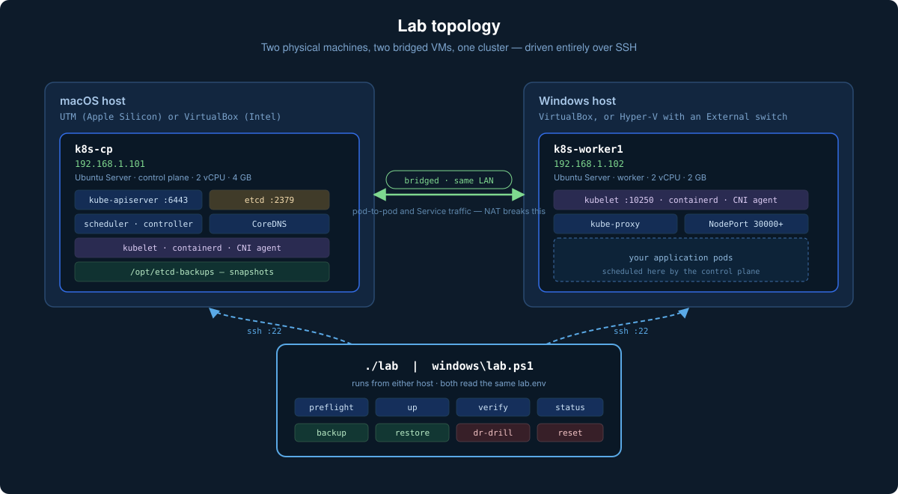
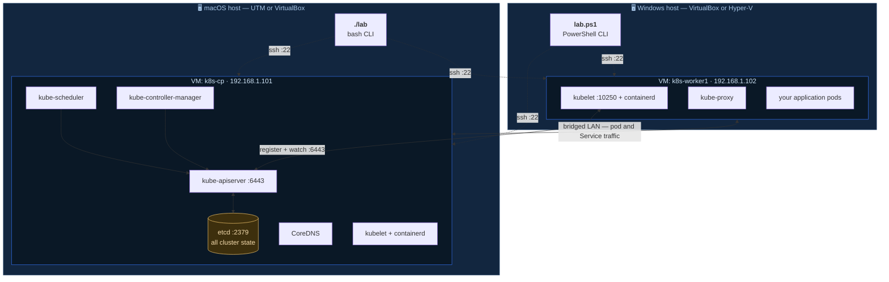
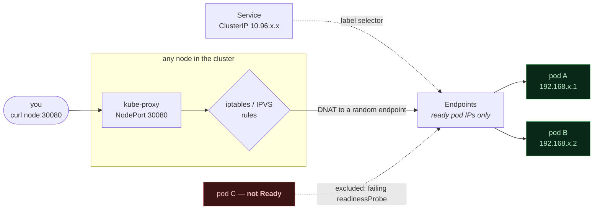
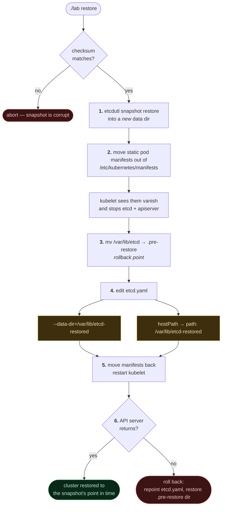
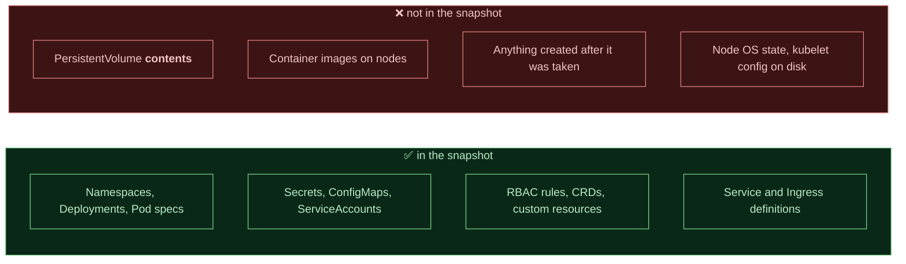
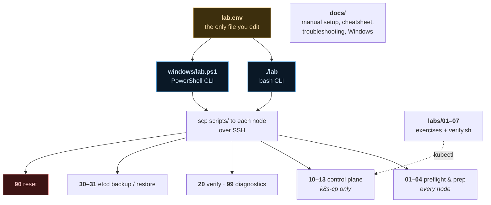

# Architecture

How the lab is put together, and what happens when you run each command.

---

## 1. Physical and logical topology

Two physical machines, one VM each, both **bridged** onto your LAN so the VMs
are peers regardless of which host they sit on. The `lab` CLI runs on either
host and drives both nodes over SSH.

> **Bridged networking is the one hard requirement.** With NAT, each VM sits
> behind its host on a private `10.0.2.x` network and the two can never reach
> each other — every other failure in this lab traces back to that one.

---

## 2. What `./lab up` actually does

Each stage is also its own command, so you can run them one at a time.

```mermaid
sequenceDiagram
    autonumber
    participant You
    participant CLI as ./lab
    participant CP as k8s-cp
    participant WK as k8s-worker1

    You->>CLI: ./lab up
    CLI->>CLI: read lab.env

    rect rgb(18, 38, 63)
    Note over CLI,WK: preflight — read-only, changes nothing
    CLI->>CP: 01-preflight.sh (cpu, ram, disk, swap, ports, clock, peers)
    CLI->>WK: 01-preflight.sh
    WK-->>CLI: PASS / FAIL per check
    end

    rect rgb(18, 38, 63)
    Note over CLI,WK: prep — runs on every node
    CLI->>CP: 02 swap off · sysctl · modules · firewall
    CLI->>CP: 03 containerd + SystemdCgroup=true
    CLI->>CP: 04 kubeadm, kubelet, kubectl (pinned, held)
    CLI->>WK: 02, 03, 04 (identical)
    end

    rect rgb(10, 40, 30)
    Note over CLI,CP: control plane
    CLI->>CP: 10-init-control-plane.sh
    CP->>CP: kubeadm init --config
    CP-->>CLI: join command + admin.conf
    CLI->>CP: 11-install-cni.sh (Calico / Flannel / Cilium)
    Note right of CP: node stays NotReady<br/>until the CNI is up
    CLI->>CP: 13-install-addons.sh
    end

    rect rgb(10, 40, 30)
    Note over CLI,WK: join
    CLI->>CP: kubeadm token create --print-join-command
    CP-->>CLI: fresh 24h token
    CLI->>WK: 12-join-worker.sh JOIN_CMD=...
    WK->>CP: kubeadm join :6443
    CP-->>WK: certs + kubelet config
    end

    CLI->>CP: 20-verify-cluster.sh
    CP->>CP: deploy → schedule → DNS → Service → HTTP 200
    CP-->>You: cluster healthy
```

---

## 3. Where a pod's traffic goes

Understanding this one picture removes most Service confusion.

**Why `kubectl get endpoints` is always the first Service command:** it splits
the problem in half. Empty means the selector matches nothing *or* no pod is
`Ready`. Populated means the problem is the port, a NetworkPolicy, or the app.

---

## 4. etcd backup and restore

The restore sequence is rigid. Each step exists because skipping it corrupts
something.

> **Steps 4a and 4b must both happen.** Changing only `--data-dir` and leaving
> the `hostPath` volume pointing at `/var/lib/etcd` gives you a control plane
> that starts cleanly against an empty directory — a cluster that looks restored
> and is actually empty. This is the single most common restore failure.

### What a snapshot does and does not cover

Because Secrets are stored unencrypted by default, **a snapshot is a file
containing every credential in your cluster.** See [SECURITY.md](../SECURITY.md).

---

## 5. Repository structure

Every node script is **idempotent**: it detects what is already done, prints
`[skip]`, and moves on. That is what lets `./lab up` double as a repair tool.

---

## 6. Design decisions

| Decision | Why |
|---|---|
| **Everything over SSH; nothing runs on the nodes permanently** | The nodes stay generic Ubuntu. Rebuild one and you lose nothing but time |
| **One config file, two CLIs** | A Mac user and a Windows user drive an identical cluster from the same `lab.env` |
| **Idempotent scripts** | Re-running is always safe, so recovery and building are the same operation |
| **Versions pinned in `lab.env`** | A lab that silently drifts is a lab that stops reproducing |
| **`kubeadm init` from a config file, not flags** | Config files are what real clusters use, and what upgrades and troubleshooting make you edit |
| **Connection details read from the live etcd manifest** | After a restore the data dir has changed; hard-coded paths would break the next backup |
| **`bash -n` clean under bash 3.2** | macOS still ships bash 3.2, so no `mapfile`, no `readarray` |
| **Firewall opened, not disabled** | Teaching people to `ufw disable` is a bad habit; the correct ports are documented and applied |
| **Every script explains *why*** | The point is that you understand what each step did, not that it worked |
